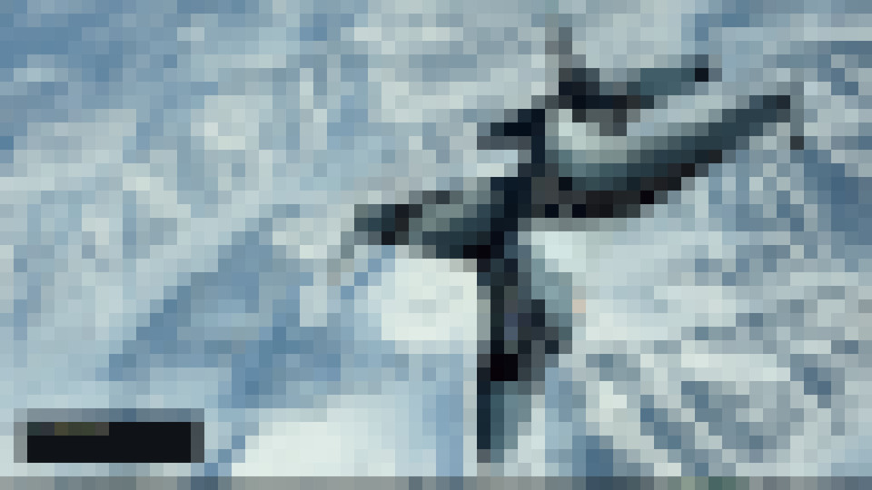

# squint
Blurs your screen 👓

A GPU accelerated program to pixelate or blur your screen, primarily for use
with `i3lock`. Currently only supports X11, but maybe some day I'll look into
Wayland too.

### Screenshots

### Storytime
Wrote this because I got fed up with the tiny 3s delay of my `maim + imagemagick`
solution on my 4k screen. Rather than looking for existing solutions, I decided
to play around with X11 and OpenGL. For this reason, I am calling directly into
XLib and loading GL functions myself.

# To do
- ~~Pixelate~~
- Blur
- Dynamic configuration    
  (Currently I'm hardcoding things as I develop.)
- More filters! ✨
- `i3lock` replacement with live blurring 🚀    
  Will be neat if a bit wasteful.
- Wayland??? 💻    
  I don't currently use it (NVidia 🤷️) but perhaps I'll switch to `sway` on my laptop.

# Usage
TO DO: once we can blur the pixels too.

# Comparison
TO DO

# Building
TO DO
